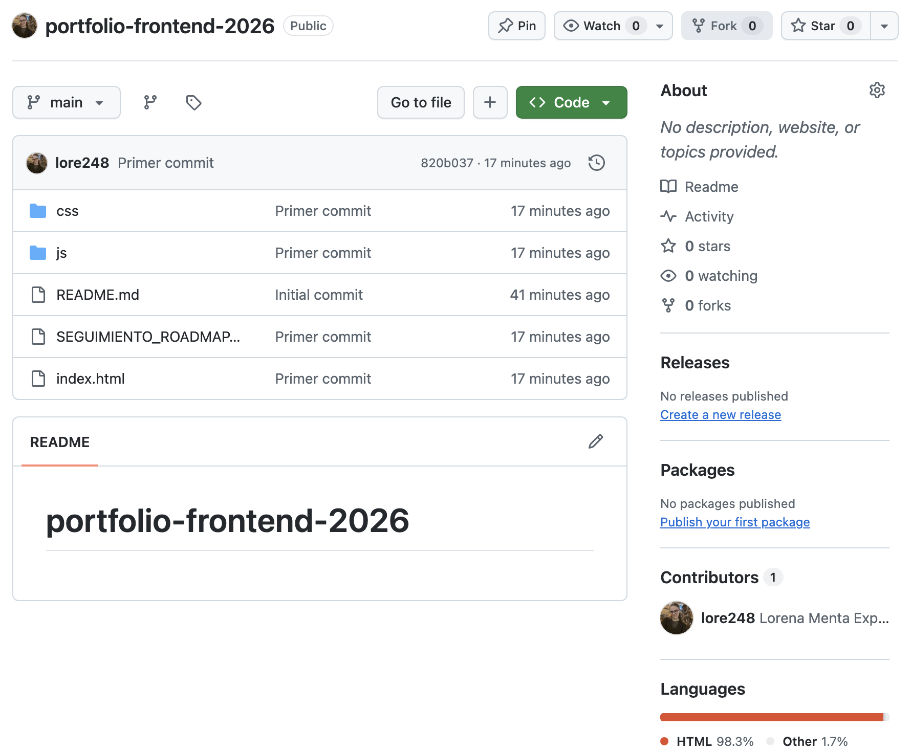

# portfolio-frontend-2026

## 📌 Descripción

Portfolio personal desarrollado durante mi formación como desarrolladora Frontend.

Este proyecto forma parte de mi roadmap de aprendizaje y tiene como objetivo reunir mis conocimientos, proyectos y evolución en desarrollo web.

## 🛠️ Tecnologías utilizadas

- HTML5
- CSS3
- JavaScript
- Git
- GitHub

## 🎯 Objetivos del proyecto

- Mejorar mis conocimientos de desarrollo Frontend.
- Practicar HTML, CSS y JavaScript.
- Aprender a crear diseños responsive.
- Crear y documentar proyectos para mi portfolio.
- Utilizar Git y GitHub como herramientas de control de versiones.
- Continuar mi formación aprendiendo nuevas tecnologías como React.

## 📂 Estructura del proyecto

- `index.html` → Página principal.
- `css/` → Archivos de estilos.
- `js/` → Archivos JavaScript.
- `img/` → Imágenes del proyecto.
- `assets/` → Recursos adicionales.
- `docs/` → Documentación.
- `screenshots/` → Capturas de pantalla.
- `README.md` → Documentación del proyecto.

## 📸 Captura del proyecto

## 🔗 Enlaces

- [Mi GitHub](https://github.com/lore248)

## 🚀 Instrucciones de uso

1. Clonar el repositorio.
2. Abrir la carpeta del proyecto.
3. Abrir el archivo `index.html` en el navegador.

## 📊 Estado del proyecto

🟡 En desarrollo.

Este proyecto continuará evolucionando a medida que avance en mi formación como desarrolladora Frontend.

## 👩‍💻 Autora

**Lorena Menta**

Desarrolladora Frontend en formación.